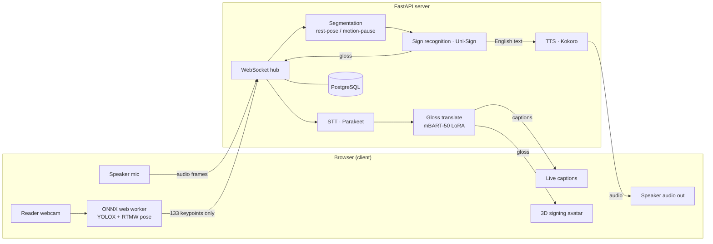
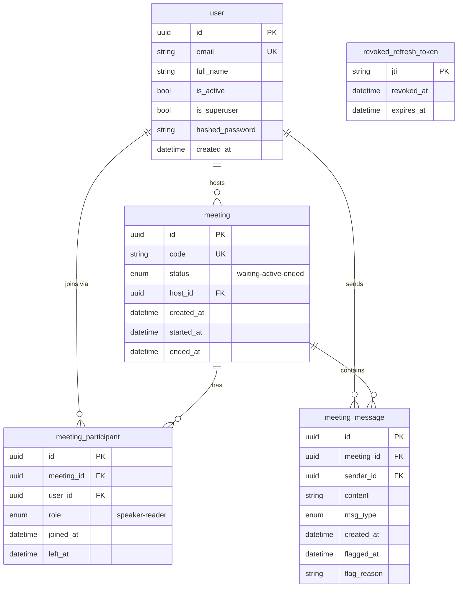

# Submission-Readiness Implementation Plan

> **For agentic workers:** REQUIRED SUB-SKILL: Use superpowers:subagent-driven-development (recommended) or superpowers:executing-plans to implement this plan task-by-task. Steps use checkbox (`- [ ]`) syntax for tracking.

**Goal:** Restructure `README.md` to the required academic submission template and close the real rubric gaps (Team Members, Supervisor, Problem Statement, System Architecture, Deployment, Usage Guide, Database Schema, API Documentation, Screenshots), reusing existing docs via links rather than duplicating them.

**Architecture:** Documentation-only change. The README becomes a rubric-shaped "front door" that links to the deep reference (`DOCUMENTATION.md`, `deploy/gcp/README.md`) instead of duplicating it. Diagrams are Mermaid (GitHub-native, text-in-README, no binary assets). No source code, tests, or runtime behavior change.

**Tech Stack:** Markdown, Mermaid (GitHub-rendered `flowchart` + `erDiagram`).

**Spec:** `docs/superpowers/specs/2026-06-13-submission-readiness-design.md`

---

## Source-of-Truth Facts (verified from the repo — use these verbatim)

**Team roster:**

| Role | Name | ID | Program |
|------|------|----|---------|
| Student 1 | Abdulrahman Mohamed Hosny | 202200066 | DSAI |
| Student 2 | Mariam Hani | 202200903 | DSAI |
| Student 3 | Youssef El Dawayaty | 202201209 | DSAI |
| Supervisor | Dr. Mohamed Sami Rakha | — | — |

**Live deployment (from `deploy/gcp/Caddyfile` + `deploy/gcp/README.md`):**
- Frontend: `https://dashboard.34.10.142.210.sslip.io`
- Backend API: `https://api.34.10.142.210.sslip.io`
- GCP VM: `e2-standard-16` (16 vCPU / 64 GB), `us-central1-a`, CPU-only, behind **Caddy** (automatic Let's Encrypt TLS). On-demand (started to save cost; was stopped at planning time).

**Database tables (from `backend/app/models.py`, `table=True` models):**
`user`, `meeting`, `meeting_participant`, `meeting_message`, `revoked_refresh_token`. Columns/relationships are encoded in the ERD in Task 6.

**API surface (from `backend/app/api/routes/*.py`, all under `settings.API_V1_STR = "/api/v1"`):**
- `login` (no prefix): `/login/access-token`, `/login/refresh`, `/login/test-token`, `/logout`, `/password-recovery/{email}`, `/reset-password/`, `/password-recovery-html-content/{email}`
- `users` (`/users`): `GET /`, `POST /`, `POST /signup`, `GET /me`, `PATCH /me`, `PATCH /me/password`, `DELETE /me`, `GET /{user_id}`, `PATCH /{user_id}`, `DELETE /{user_id}`
- `meetings` (`/meetings`): `POST /`, `GET /`, `GET /{code}`, `POST /{code}/join`, `POST /{meeting_id}/end`, `GET /{meeting_id}/messages`, `POST /{meeting_id}/messages/{message_id}/flag`
- `utils` (`/utils`): `POST /test-email/`, `GET /health-check/`, `GET /healthz/live`, `GET /healthz/ready`
- WebSocket (mounted at root, not under `/api/v1`): `/ws/{meeting_id}`
- OpenAPI JSON: `/api/v1/openapi.json` · Swagger UI: `/docs` · ReDoc: `/redoc`

---

## File Structure

| File | Responsibility | Action |
|------|----------------|--------|
| `README.md` | Rubric-shaped front door | Restructure (Tasks 3–5) |
| `docs/screenshots/README.md` | Capture checklist + filename slots | Create (Task 1) |
| `img/dashboard.png`, `img/dashboard-dark.png`, `img/dashboard-items.png`, `img/docs.png`, `img/login.png`, `img/github-social-preview.png`, `img/github-social-preview.svg` | Stale FastAPI-template leftovers | Delete (Task 2) |

The new README section order (template order; retained sections noted):

1. Title + description *(keep)*
2. **Team Members** *(new, Task 3)*
3. **Problem Statement** *(new, Task 3)*
4. Features *(keep)*
5. **System Architecture** + Mermaid flow *(new, Task 4)*
6. Technologies Used *(keep, renamed from "Tech Stack")*
7. Environment Requirements / Prerequisites *(keep)*
8. Setup Instructions *(keep: Quick Start + Local Dev)*
9. Environment Variables *(keep)*
10. **Deployment Instructions** *(new, Task 4)*
11. **Usage Guide** *(new — promotes "How It Works", Task 4)*
12. **Database Schema** + Mermaid ERD *(new, Task 5)*
13. **API Documentation** *(new, Task 5)*
14. **Screenshots / Demo** *(new, Task 5)*
15. Project Structure *(keep)*
16. Common Commands *(keep)*
17. ML Models *(keep)*
18. Privacy & Known Model Limitations *(keep)*
19. **Credits & Acknowledgements** *(slimmed from old "Team & Provenance" — model citations kept, solo-authorship claim removed)*
20. Further Documentation *(keep)*

---

## Task 1: Create the screenshots capture scaffold

**Files:**
- Create: `docs/screenshots/README.md`

- [ ] **Step 1: Create the capture checklist file**

Create `docs/screenshots/README.md` with exactly this content:

````markdown
# Screenshots

Drop PNGs here using the exact filenames below so the links in the root
`README.md` "Screenshots / Demo" section resolve. Capture at ~1280×800,
light theme unless noted.

| Filename | Screen to capture |
|----------|-------------------|
| `01-login.png` | Login / sign-up page |
| `02-dashboard.png` | Dashboard after login (meeting history) |
| `03-create-meeting.png` | Create-meeting dialog showing the shareable code (e.g. `XKF-8291`) |
| `04-waiting-room.png` | Waiting room before the second participant joins |
| `05-speaker-view.png` | Speaker view: live captions + transcript panel |
| `06-reader-view-avatar.png` | Reader view: 3D signing avatar mid-sign |
| `07-gloss-feed.png` | Gloss feed / pending-sign feedback panel |
| `08-direction-b-signing.png` | Reader signing at camera (Direction B) with recognized words |

## How to capture
1. Start the stack (`docker compose watch`) with mock ML modes for speed
   (`STT_MOCK_MODE=true`, `TTS_MOCK_MODE=true`, `SIGN_TO_TEXT_MOCK_MODE=true`,
   `TRANSLATION_MOCK_MODE=true` in `.env`), or point at the live demo.
2. Open two browser windows (one speaker, one reader) joined to the same code.
3. Capture each screen above. Crop to the app; avoid browser chrome where possible.
````

- [ ] **Step 2: Verify the file exists and renders**

Run: `cat docs/screenshots/README.md | head -5`
Expected: prints the `# Screenshots` heading and intro.

- [ ] **Step 3: Commit**

```bash
git add docs/screenshots/README.md
git commit -m "docs(screenshots): add capture checklist + filename slots"
```

---

## Task 2: Remove stale FastAPI-template screenshots

**Files:**
- Delete: `img/dashboard.png`, `img/dashboard-dark.png`, `img/dashboard-items.png`, `img/docs.png`, `img/login.png`, `img/github-social-preview.png`, `img/github-social-preview.svg`

- [ ] **Step 1: Confirm nothing in the repo references these images**

Run:
```bash
grep -rnE "img/(dashboard|docs|login|github-social-preview)" \
  --include="*.md" --include="*.html" --include="*.tsx" --include="*.ts" \
  . 2>/dev/null | grep -v node_modules | grep -v .venv
```
Expected: **no output** (the current README does not embed these). If any
reference appears, update or remove that reference before deleting.

- [ ] **Step 2: Delete the stale images**

```bash
git rm img/dashboard.png img/dashboard-dark.png img/dashboard-items.png \
  img/docs.png img/login.png img/github-social-preview.png img/github-social-preview.svg
```

- [ ] **Step 3: Verify the img/ folder is empty (or gone)**

Run: `ls img 2>/dev/null || echo "img/ removed"`
Expected: empty listing or `img/ removed`.

- [ ] **Step 4: Commit**

```bash
git commit -m "chore(assets): remove stale FastAPI-template screenshots"
```

---

## Task 3: README — Team Members + Problem Statement (top of file)

**Files:**
- Modify: `README.md` (insert after the intro bullets at line ~6, before `## Features`)

- [ ] **Step 1: Insert the Team Members and Problem Statement sections**

Insert this block immediately **after** the two Direction A/B intro bullets and
**before** `## Features`:

```markdown
## Team Members

| Name | ID | Program |
|------|----|---------|
| Abdulrahman Mohamed Hosny | 202200066 | DSAI |
| Mariam Hani | 202200903 | DSAI |
| Youssef El Dawayaty | 202201209 | DSAI |

**Supervisor:** Dr. Mohamed Sami Rakha

## Problem Statement

Communication between Deaf/Hard-of-Hearing (Deaf/HoH) signers and hearing
non-signers is routinely blocked by the absence of a shared language. Human
interpreters are scarce, expensive, and not available on demand, while generic
captioning only solves one direction (speech → text) and ignores the signer
entirely. SignSpeak addresses this by providing **real-time, two-way**
translation in a single browser-based meeting: a hearing speaker's speech is
transcribed and rendered as sign by a 3D avatar, and a signer's signs are
recognized from their webcam and spoken aloud — with the signer's video never
leaving their device.
```

- [ ] **Step 2: Verify both sections are present and the table is intact**

Run:
```bash
grep -nE "^## Team Members|^## Problem Statement|Dr\. Mohamed Sami Rakha|202200066" README.md
```
Expected: matches for all four (Team Members heading, Problem Statement heading, supervisor, and student ID).

- [ ] **Step 3: Commit**

```bash
git add README.md
git commit -m "docs(readme): add Team Members, Supervisor, and Problem Statement"
```

---

## Task 4: README — Architecture, Deployment, Usage Guide

**Files:**
- Modify: `README.md`

- [ ] **Step 1: Add the System Architecture section (Mermaid flow) after `## Features`**

Insert after the `## Features` list:

````markdown
## System Architecture

SignSpeak is a FastAPI backend + React frontend joined by a single WebSocket per
meeting that multiplexes JSON control frames and binary audio/keypoint frames.
ML runs on our own server; the **only** data that leaves the reader's browser is
133 pose keypoints (never video).



**Direction A (speech → sign):** mic audio → STT → gloss translation → 3D avatar
+ live captions.
**Direction B (sign → speech):** webcam → in-browser pose extraction → keypoints
over WebSocket → segmentation → sign recognition → English → TTS.
````

- [ ] **Step 2: Rename the existing `## Tech Stack` heading to `## Technologies Used`**

Change the heading on the existing tech-stack table from `## Tech Stack` to
`## Technologies Used` (keep the table body unchanged). The template names this
section "Technologies Used".

- [ ] **Step 3: Add the Deployment Instructions section (after Environment Variables)**

Insert after the `## Environment Variables` section:

````markdown
## Deployment Instructions

The production deployment is a **CPU-only GCP VM** behind Caddy (automatic
HTTPS), not the generic Traefik guide in `deployment.md`. The authoritative
runbook is [`deploy/gcp/README.md`](./deploy/gcp/README.md).

**Live demo (on-demand):** https://dashboard.34.10.142.210.sslip.io
> The demo runs on an on-demand CPU-only VM that is stopped to save cost, so the
> URL may be unreachable until the VM is started (see the runbook below). The
> backend health check is `https://api.34.10.142.210.sslip.io/api/v1/utils/healthz/ready`.

Bring-up summary (full detail in the runbook):

```bash
# 1. Create the VM + static IP (prints DOMAIN=<ip>.sslip.io)
bash deploy/gcp/01-create-vm.sh

# 2. Install Docker + clone repo on the VM
bash deploy/gcp/02-setup-vm.sh

# 3. Stage ML model weights (Uni-Sign, mT5, Kokoro)
bash deploy/gcp/03-stage-models.sh

# 4. Start app + Caddy reverse proxy (TLS via Let's Encrypt)
docker compose -f compose.yml -f deploy/gcp/compose.cpu.yml up -d
docker compose -f deploy/gcp/docker-compose.caddy.yml -p caddy up -d
```

`sslip.io` provides free wildcard DNS (`<ip>.sslip.io` → that IP), so no domain
purchase is required. Caddy serves `dashboard.<ip>.sslip.io` (frontend) and
`api.<ip>.sslip.io` (backend) per [`deploy/gcp/Caddyfile`](./deploy/gcp/Caddyfile).
````

- [ ] **Step 4: Promote "How It Works" into a `## Usage Guide`**

Replace the existing `## How It Works` heading with `## Usage Guide`, and keep
its numbered list. Prepend this short intro line under the new heading so it
reads as an end-user guide:

```markdown
## Usage Guide

Once the app is running (locally or via the live demo), a meeting works like this:
```

(The existing numbered steps 1–4 that follow remain unchanged.)

- [ ] **Step 5: Verify all four edits landed**

Run:
```bash
grep -nE "^## System Architecture|^## Technologies Used|^## Deployment Instructions|^## Usage Guide|34.10.142.210.sslip.io|```mermaid" README.md
```
Expected: matches for each new/renamed heading, the demo URL, and at least one
```mermaid``` fence. Confirm `## Tech Stack` and `## How It Works` no longer exist:
```bash
grep -nE "^## Tech Stack|^## How It Works" README.md || echo "old headings gone (good)"
```
Expected: `old headings gone (good)`.

- [ ] **Step 6: Commit**

```bash
git add README.md
git commit -m "docs(readme): add System Architecture, Deployment, and Usage Guide"
```

---

## Task 5: README — Database Schema, API Documentation, Screenshots; fix authorship

**Files:**
- Modify: `README.md`

- [ ] **Step 1: Add the Database Schema section (Mermaid ERD) after the Usage Guide**

````markdown
## Database Schema

PostgreSQL via SQLModel + Alembic migrations (`backend/app/alembic/versions/`).
Five tables; full field-level reference in
[`DOCUMENTATION.md` §3 (Data Models & Schemas)](./DOCUMENTATION.md#3-data-models--schemas).



`meeting_participant` has a unique constraint on `(meeting_id, user_id)`; all
foreign keys cascade-delete. `revoked_refresh_token` is a standalone blacklist of
rotated refresh-token JTIs (no foreign key).
````

- [ ] **Step 2: Add the API Documentation section after the Database Schema**

````markdown
## API Documentation

The REST API is OpenAPI-documented and browsable live:

| Resource | URL |
|----------|-----|
| Swagger UI | `/docs` |
| ReDoc | `/redoc` |
| OpenAPI JSON | `/api/v1/openapi.json` |

All REST routes are under the `/api/v1` prefix. The exported spec is committed at
[`frontend/openapi.json`](./frontend/openapi.json) and drives the typed frontend
client (`bun run generate-client`).

| Group | Representative endpoints |
|-------|--------------------------|
| **Auth** | `POST /login/access-token`, `POST /login/refresh`, `POST /logout`, `POST /password-recovery/{email}`, `POST /reset-password/` |
| **Users** | `POST /users/signup`, `GET /users/me`, `PATCH /users/me`, `GET /users/` *(superuser)* |
| **Meetings** | `POST /meetings/`, `GET /meetings/`, `GET /meetings/{code}`, `POST /meetings/{code}/join`, `POST /meetings/{meeting_id}/end` |
| **Messages** | `GET /meetings/{meeting_id}/messages`, `POST /meetings/{meeting_id}/messages/{message_id}/flag` |
| **Health** | `GET /utils/healthz/live`, `GET /utils/healthz/ready` |
| **Real-time** | `WS /ws/{meeting_id}` — JSON control + binary audio/keypoint frames |

See Swagger `/docs` for the authoritative, always-current request/response schemas.
````

- [ ] **Step 3: Add the Screenshots / Demo section after the API Documentation**

````markdown
## Screenshots / Demo

Screenshots live in [`docs/screenshots/`](./docs/screenshots/) (see that folder's
README for the capture checklist).

| | |
|---|---|
| Login |  |
| Dashboard |  |
| Speaker view (captions) |  |
| Reader view (3D avatar) |  |
| Direction B (signing) |  |

> **Live demo:** https://dashboard.34.10.142.210.sslip.io (on-demand VM — see
> [Deployment Instructions](#deployment-instructions)).
````

- [ ] **Step 4: Replace the old "Team & Provenance" section with a slimmed "Credits & Acknowledgements"**

Find the existing `## Team & Provenance` section (the paragraph claiming the repo
was "built by **@manohosny**") and **replace the entire section** with:

````markdown
## Credits & Acknowledgements

SignSpeak's ML stages build on pretrained models we integrate (not author); our
contribution is the segmentation, real-time pipeline, and serving around them:

- **Sign recognition (Direction B):** [Uni-Sign](https://github.com/ZechengLi19/Uni-Sign) —
  Li, Zhou, Zhao, Wu, Hu, Li, *Uni-Sign: Toward Unified Sign Language Understanding
  at Scale*, ICLR 2025 ([arXiv:2501.15187](https://arxiv.org/abs/2501.15187)).
- **STT:** NVIDIA Parakeet TDT 0.6B · **TTS:** Kokoro 82M · **Browser pose:**
  YOLOX-tiny + RTMW (MMPose) · **Gloss translation:** mBART-50, LoRA-fine-tuned
  in-house as `manohonsy/asl-mbart-50-lora`.

The project was scaffolded from the
[FastAPI full-stack template](https://github.com/fastapi/full-stack-fastapi-template)
(template authors appear in the inherited git history). SignSpeak-specific work is
visible via `git log --since=2025-03-01 --no-merges`.
````

- [ ] **Step 5: Verify the authorship contradiction is gone and new sections exist**

Run:
```bash
grep -nE "built by \*\*@manohosny\*\*|^## Team & Provenance" README.md || echo "solo-authorship claim removed (good)"
grep -nE "^## Database Schema|^## API Documentation|^## Screenshots / Demo|^## Credits & Acknowledgements|erDiagram" README.md
```
Expected: first line prints `solo-authorship claim removed (good)`; second line
matches all four new headings plus `erDiagram`.

- [ ] **Step 6: Commit**

```bash
git add README.md
git commit -m "docs(readme): add Database Schema, API docs, Screenshots; replace solo-authorship with team credits"
```

---

## Task 6: Final verification sweep

**Files:** none modified unless a check fails.

- [ ] **Step 1: Confirm every required template section is present, in order**

Run:
```bash
grep -nE "^# SignSpeak|^## Team Members|^## Problem Statement|^## Features|^## System Architecture|^## Technologies Used|^## Setup|^## Deployment Instructions|^## Usage Guide|^## Database Schema|^## API Documentation|^## Screenshots / Demo" README.md
```
Expected: all headings appear, and their line numbers are strictly increasing
(template order). If any are missing or out of order, fix in `README.md`.

- [ ] **Step 2: Confirm both Mermaid diagrams are well-formed fences**

Run:
```bash
grep -c '```mermaid' README.md
```
Expected: `2` (System Architecture flowchart + Database Schema ERD). Then open
the README on GitHub (or a Mermaid live preview) and confirm both render without
a "syntax error" box.

- [ ] **Step 3: Confirm no broken internal links to deleted/renamed files**

Run:
```bash
grep -oE "\]\(\.?/?[A-Za-z0-9._/-]+\)" README.md | tr -d '()' | sed 's/^.//' | while read -r p; do
  p="${p#/}"; [ -e "$p" ] || echo "MISSING: $p"
done
```
Expected: no `MISSING:` lines for local paths (anchors like `#deployment-instructions`
and `http(s)://` links are expected to be skipped/!exist — ignore those; only
local file paths must resolve). Notably `deploy/gcp/README.md`, `deploy/gcp/Caddyfile`,
`DOCUMENTATION.md`, `frontend/openapi.json`, and `docs/screenshots/` must exist.

- [ ] **Step 4: Confirm contribution history still shows all three students**

Run:
```bash
git shortlog -sne --no-merges HEAD | grep -iE "manohosny|mariam|youssef"
```
Expected: three lines (Abdulrahman/manohosny, Mariam Hani, Youssef-ElDawayaty) —
matching the Team Members table.

- [ ] **Step 5: Commit any fixes (only if a check required changes)**

```bash
git add README.md && git commit -m "docs(readme): fix verification-sweep findings"
```
(If no checks failed, skip this commit.)

---

## Self-Review (completed by plan author)

**Spec coverage:** Every spec deliverable maps to a task — Team table/Supervisor/Problem Statement (Task 3), Architecture + Mermaid (Task 4), Deployment real-path + URL (Task 4), Usage Guide (Task 4), Database Schema + ERD (Task 5), API Documentation (Task 5), Screenshots scaffold (Task 1) + section (Task 5), stale-asset removal (Task 2), authorship-contradiction fix (Task 5), final audit (Task 6). ✅

**Placeholder scan:** All section content is shown verbatim; no TBD/TODO. ✅

**Type/name consistency:** ERD table/column names match `backend/app/models.py`; endpoint paths match `backend/app/api/routes/*.py`; screenshot filenames in Task 1 match the image links in Task 5 Step 3. ✅
